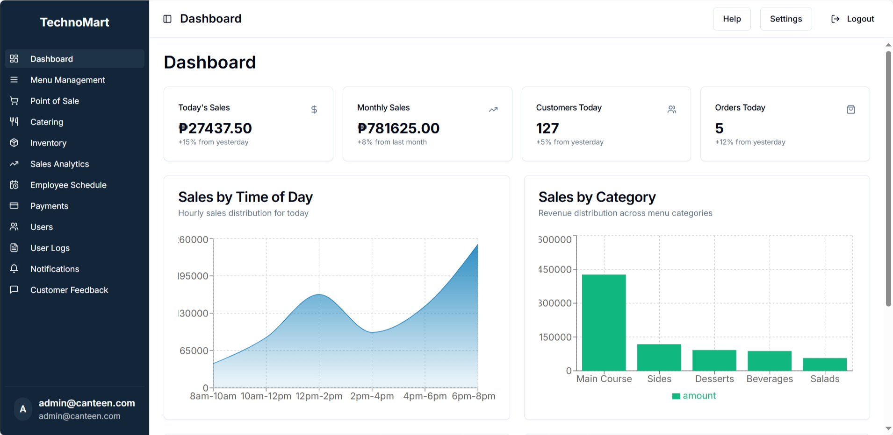

# TechnoMart Canteen Management System

A modern canteen ordering and operations platform for the CTU‑MC Multipurpose Cooperative. It digitizes ordering, payments, inventory, user management, and analytics — optimized for speed, accessibility, and responsiveness across devices.

This repo contains both the React frontend (Vite) and the Django backend API.

---

## Screenshot



---

## Technology Stack (with purpose)

- Frontend (React)
  - Vite 5 + React (SWC): fast dev server/build toolchain.
  - React 19: UI framework.
  - React Router 7: routing and navigation.
  - Tailwind CSS 3 + tailwindcss-animate + tailwind-merge + typography: utility‑first styling, animations, class merging, rich text styling.
  - shadcn/ui (custom components under `src/components/ui`): headless, accessible UI built on Radix primitives, styled with Tailwind.
  - Radix UI primitives (@radix‑ui/\*): accessible UI building blocks.
  - TanStack React Query: data fetching/cache, mutations, background refetching.
  - lucide-react: icon set.
  - react-hook-form + @hookform/resolvers + zod: forms with schema validation.
  - date-fns: date utilities.
  - recharts: charts and visualizations.
  - embla-carousel-react: carousel UI.
  - sonner: toast notifications.
  - jspdf + jspdf-autotable: PDF export for reports.
  - input-otp: OTP input control.
  - react-resizable-panels: resizable layout panes.
  - next-themes: dark/light theme toggling.
  - cmdk: command palette.
  - class-variance-authority + clsx: class composition helpers.

- Backend (Django)
  - Django 5.x (requirements specify 4.2–<6.0): web framework for the API.
  - django-cors-headers: CORS for SPA → API requests.
  - django-allauth: Google OAuth and social auth plumbing.
  - google-auth: Google ID token verification (One‑Tap / GIS).
  - PyJWT: JSON Web Tokens for stateless API auth.
  - python-dotenv: .env loading for settings and secrets.
  - cryptography: crypto primitives used by dependencies.
  - requests: OAuth code exchange (Google) and HTTP utilities.
  - Database: SQLite by default; MySQL/Postgres supported via env (optional drivers).

- Developer Tooling
  - ESLint (flat config), Prettier: code quality and formatting.
  - Husky + lint-staged: pre‑commit lint/format.
  - TypeScript tooling (app code is JS but TS support is configured).

---

## Major Features

- POS: walk‑in/online orders, discounts, live queue updates.
- Menu management: add/edit, toggle availability, image uploads.
- Inventory tracking: filters, recent activity, CRUD.
- Payments: methods, transactions, basic exports (PDF).
- Analytics: KPIs, time‑series charts, popular items.
- Users & Roles (RBAC): role configuration, activation/deactivation.
- Employee scheduling and staff overview.
- Catering events: menu selection and orders.
- Customer feedback: collection, metrics, reply workflow.
- Authentication: email/password; Google sign‑in (GIS/One‑Tap supported).
- Access control & onboarding: pending verification with headshot capture and admin approval.
- Notifications & realtime hooks (extensible via WS).

---

## Architecture Overview

- Frontend SPA (Vite React) talks to backend at `/api/*` (dev proxy forwards to `http://localhost:8000`).
- JWT‑based auth for API access; bearer tokens sent via `Authorization: Bearer <jwt>`.
- Social login via allauth (Google). New users are created as `pending` with no privileges.
- Verify Identity flow (frontend) captures a headshot and uploads it via a short‑lived verify token.
- Admins review and approve/reject in the app (Users → Pending Verifications) or via Django Admin.
- Middleware (`api.middleware.PendingUserGateMiddleware`) gates non‑public API routes until users are `active` and have an approved role (Admin/Manager/Staff).
- Headshots stored in private media (not served publicly); streamed via authenticated endpoints only.

---

## Backend Setup

Prereqs: Python 3.11+ recommended.

```powershell
cd backend
python -m venv .venv
./.venv/Scripts/Activate.ps1   # Windows
# source .venv/bin/activate    # macOS/Linux
pip install -U pip setuptools wheel
pip install -r requirements.txt

# Migrate and run
python manage.py migrate
python manage.py runserver 0.0.0.0:8000
```

Health check: http://localhost:8000/api/health/

Bootstrap an admin AppUser (in‑app admin used by the SPA):

```powershell
python manage.py bootstrap_admin --email "your-email@example.com" --password "your-strong-pass" --name "Admin" --role admin
```

Optional: Django Admin superuser for `/admin` (separate from AppUser):

```powershell
python manage.py createsuperuser
```

### Backend Environment (.env)

Copy `backend/.env.example` to `backend/.env` and set:

- Core: `DJANGO_SECRET_KEY`, `DJANGO_DEBUG`, `DJANGO_ALLOWED_HOSTS`
- Google OAuth: `GOOGLE_CLIENT_ID`, `GOOGLE_CLIENT_SECRET`
- JWT: `DJANGO_JWT_SECRET`, `DJANGO_JWT_ALG`, `DJANGO_JWT_EXP_SECONDS`
- Email: `DJANGO_EMAIL_BACKEND` (defaults to console), `DJANGO_DEFAULT_FROM_EMAIL`, SMTP vars (`DJANGO_EMAIL_HOST`, `DJANGO_EMAIL_PORT`, `DJANGO_EMAIL_HOST_USER`, `DJANGO_EMAIL_HOST_PASSWORD`, `DJANGO_EMAIL_USE_TLS`, `DJANGO_EMAIL_USE_SSL`), `DJANGO_ADMINS`
- Database (optional): see Database below

### Database

Default is SQLite file at `backend/db.sqlite3`.

To use MySQL (wired; driver not installed by default):

```
DJANGO_DB_ENGINE=mysql
DJANGO_DB_NAME=technomart
DJANGO_DB_USER=tm_user
DJANGO_DB_PASSWORD=strong-pass
DJANGO_DB_HOST=127.0.0.1
DJANGO_DB_PORT=3306
DJANGO_DB_CONN_MAX_AGE=60
```

Install a driver: `pip install mysqlclient` (or `PyMySQL` + adapter).

To use Postgres:

```
DJANGO_DB_ENGINE=postgres
DJANGO_DB_NAME=technomart
DJANGO_DB_USER=tm_user
DJANGO_DB_PASSWORD=strong-pass
DJANGO_DB_HOST=127.0.0.1
DJANGO_DB_PORT=5432
DJANGO_DB_CONN_MAX_AGE=60
```

Install a driver: `pip install psycopg2-binary` (or `psycopg`).

### Email Notifications

Emails are sent on:

- Verification submission (user notified; admins notified via `mail_admins`).
- Approval (user notified).
- Rejection (user notified, includes optional reviewer note).

Defaults to console backend (emails printed to the runserver console). Configure SMTP in `.env` for real emails.

### Auth & Access Control

- Social login: django‑allauth (Google), with server‑side ID token verification.
- New or unassigned users → `status=pending`; no JWT issued until approval.
- Verify Identity page (frontend) captures a headshot, uploads via a short‑lived verify token.
- Admin reviews in Users → Pending Verifications (in‑app UI) or Django Admin `/admin`.
- On approval: role set (Admin/Manager/Staff), `status=active`; subsequent logins receive a JWT.
- Middleware blocks `/api/*` routes for non‑approved users.

Key endpoints (backend):

- Health: `GET /api/health/`
- Auth: `POST /api/auth/login|register|logout|refresh-token|forgot-password|reset-password`
- Me: `GET /api/auth/me`
- Google: `POST /api/auth/google` (GIS One‑Tap token or auth code exchange)
- Face: `POST /api/auth/face-register` (logged-in user registers template), `POST /api/auth/face-login` (submit image to login)
- Verify: `GET /api/verify/status`, `POST /api/verify/upload`
- Review: `GET /api/verify/requests`, `POST /api/verify/approve`, `POST /api/verify/reject`, `GET /api/verify/headshot/<uuid>`
- Users/Menu/Inventory/etc.: see `backend/api/urls.py`

---

## Frontend Setup

Prereqs: Node.js 18+ and npm.

```bash
npm install
npm run dev
```

Dev server: http://localhost:8080 (proxies `/api/*` → `http://localhost:8000`).

### Frontend Environment (.env)

Copy `.env.example` to `.env` and set:

- `VITE_API_BASE_URL` — `/api` in dev to use the proxy; production API origin in prod.
- `VITE_DEV_PROXY_TARGET` — backend origin for proxy (e.g., `http://localhost:8000`).
- `VITE_ENABLE_MOCKS` — `false` to use real API; when `true`, API services return mock data.
- `VITE_SEND_CREDENTIALS`, `VITE_CSRF_COOKIE_NAME`, `VITE_CSRF_HEADER_NAME` — for cookie‑based auth (not used by default; JWT is used).
- `VITE_GOOGLE_CLIENT_ID` — Google Web Client ID for One‑Tap/button flows.

### Scripts

- `npm run dev` — start Vite dev server
- `npm run dev:force` — dev server with full rebuild
- `npm run build` — production build to `dist/`
- `npm run build:dev` — non‑minified dev build
- `npm run preview` — preview built app locally
- `npm run lint` / `npm run lint:fix` — ESLint
- `npm run format` — Prettier
- `npm run clean:vite` — clear Vite cache

---

## Troubleshooting

- 404 at backend root `/`: root redirects to `/api/health/`.
- ModuleNotFoundError: allauth — `pip install -r backend/requirements.txt` in your venv.
- 500 on `/api/*` from frontend — ensure backend is running at `http://localhost:8000` and `VITE_ENABLE_MOCKS=false`; check runserver console for tracebacks.
- Google login pending — new accounts are `pending` until admin approval; only approved users receive a JWT.
- CORS issues — backend uses `django-cors-headers`; adjust `CORS_ALLOWED_ORIGINS`/`ALLOWED_HOSTS` in `backend/config/settings.py`.

---

## Project Structure

Frontend

- `src/api/` — API client, services, schemas (zod), mappers.
- `src/components/` — feature modules and `ui/*` components (shadcn).
- `src/pages/` — route pages (lazy loaded).
- `src/hooks/` — React Query hooks and domain logic.
- `src/lib/` — helpers (`google.js`, `realtime.js`, `utils.js`).

Backend

- `backend/api/` — models, views, middleware, admin, emails, URLs.
- `backend/accounts/` — allauth adapter.
- `backend/config/` — Django settings and URLs.
- `backend/manage.py` — admin commands; includes `bootstrap_admin`.

---

If you need other providers (Azure AD, Facebook) or extra roles/permissions, we can extend the allauth adapter and RBAC model accordingly.
